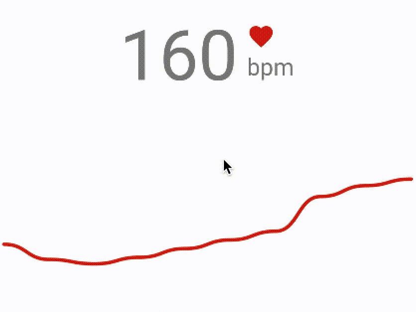

Snake View
=====================



Snake library is a simple and animation line chart for Android.

## Latest Version

[  ](https://bintray.com/txusballesteros/maven/Snake/_latestVersion) 

## How to use

### Configuring your project dependencies

Add the library dependency to your build.gradle file.

```groovy
dependencies {
    ...
    compile 'com.txusballesteros:snake:1.0'
}
```

### Adding the view to your layout

Add the view to your xml layout file.

```xml
<com.txusballesteros.SnakeView
        android:id="@+id/snake"
        android:layout_width="match_parent"
        android:layout_height="100dp" />
```

### Setting the values

Setting the minimum and maximum values of the scale of the chart.

```java
final SnakeView snakeView = (SnakeView)findViewById(R.id.snake);
                snakeView.setMinValue(0);
                snakeView.setMaxValue(100);
```

Adding values to the chart.

```java
final SnakeView snakeView = (SnakeView)findViewById(R.id.snake);
                snakeView.addValue(100);
```

## License

Copyright Txus Ballesteros 2015 (@txusballesteros)

This file is part of some open source application.

Licensed to the Apache Software Foundation (ASF) under one
or more contributor license agreements.  See the NOTICE file
distributed with this work for additional information
regarding copyright ownership.  The ASF licenses this file
to you under the Apache License, Version 2.0 (the
"License"); you may not use this file except in compliance
with the License.  You may obtain a copy of the License at

  http://www.apache.org/licenses/LICENSE-2.0

Unless required by applicable law or agreed to in writing,
software distributed under the License is distributed on an
"AS IS" BASIS, WITHOUT WARRANTIES OR CONDITIONS OF ANY
KIND, either express or implied.  See the License for the
specific language governing permissions and limitations
under the License.

Contact: Txus Ballesteros <txus.ballesteros@gmail.com>